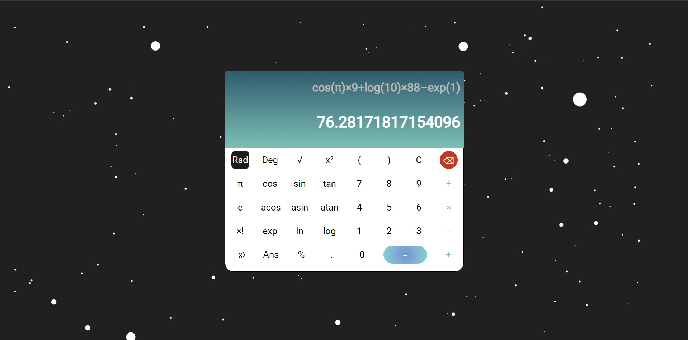

# Calculator 📟

This is a calculator web application built with HTML, CSS, and JavaScript. It provides various mathematical functions, including basic arithmetic operations, trigonometric functions, powers, factorials, and more. The calculator has a user-friendly interface and supports both radian and degree modes.

## Features 🧾

- Basic arithmetic operations: addition ➕, subtraction ➖, multiplication ✖️, and division ➗.
- Trigonometric functions: sin, cos, tan, asin, acos, atan.
- Mathematical functions: square root, power, factorial, exponential, natural logarithm, and logarithm with base 10.
- Switch between radian and degree modes.
- Syntax error handling for invalid expressions.

## How It Works 🧮

The calculator takes input from the buttons pressed and generates a formula to evaluate. It also allows users to switch between radian and degree modes for trigonometric functions.

The application uses the `eval()` function in JavaScript to evaluate the formula and display the result on the screen. For complex calculations involving power and factorial, it applies additional custom logic to ensure accurate results.

## Note 

Please note that this calculator is intended for educational and demonstration purposes only and may not cover all edge cases.